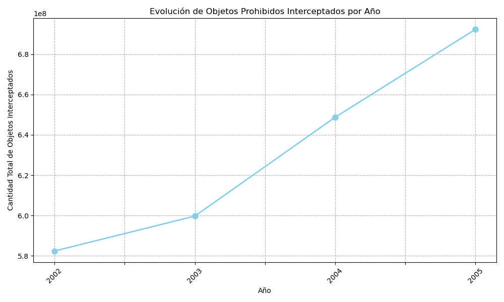
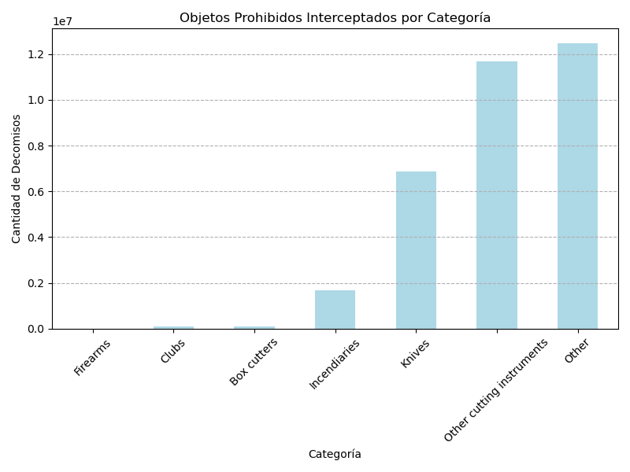
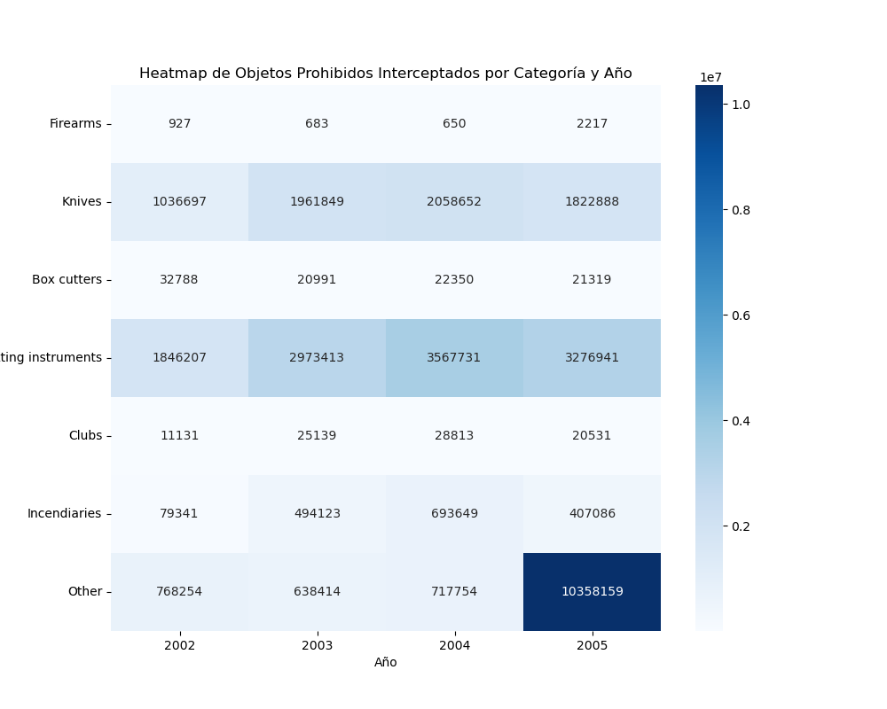
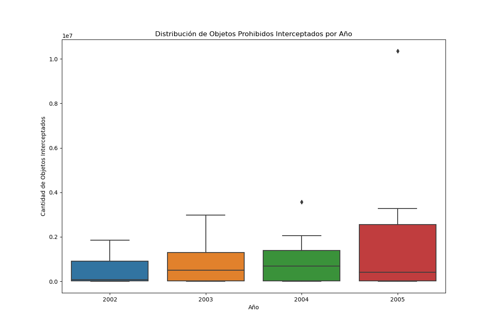

# Tarea 5
En la práctica1 se realiza un estudio estadísco sobre "Prohibited Items Intercepted at Airport Screening Checkpoints" los datos recopilados por  Bureau of Transportation Statistics se guardaron localmente a través de https://www.bts.gov/sites/bts.dot.gov/files/legacy/publications/national_transportation_statistics/2007/csv/table_02_16b.csv.

## Análisis de los datos sobre Objetos Prohibidos Interceptados en Puntos de Control de Seguridad

A continuación se presentan varias visualizaciones generadas a partir de los datos de objetos prohibidos interceptados en puntos de control de seguridad de aeropuertos entre los años 2002 y 2005.

### Tendencias Anuales de Objetos Prohibidos Interceptados

**Figura 1: Gráfico de Líneas de Tendencias Anuales**

Este gráfico de líneas capta la progresión de los objetos prohibidos interceptados en los puntos de control de seguridad a lo largo del tiempo. Se revela una tendencia ascendente constante de interceptaciones desde 2002 hasta 2005, lo que podría reflejar una serie de factores, incluido el perfeccionamiento de las técnicas de seguridad o un cambio en el comportamiento de los pasajeros. Este aumento también podría correlacionarse con el creciente volumen de viajeros, poniendo en relieve la escala creciente de los desafíos de seguridad.

### Objetos Prohibidos Interceptados por Categoría

**Figura 2: Gráfico de Barras por Categoría**

Analizando más de cerca, este gráfico de barras muestra cómo se distribuyen las interceptaciones entre diferentes categorías de objetos prohibidos. La categoría 'Other' muestra una predominancia notable, lo que sugiere que una gran variedad de objetos no convencionales son incautados regularmente. Este podría ser un indicativo de la naturaleza siempre cambiante de las amenazas a la seguridad y la necesidad de adaptación constante en los protocolos de seguridad aeroportuaria.

### Heatmap de Objetos Prohibidos Interceptados por Categoría y Año

**Figura 3: Heatmap de Interceptaciones por Categoría y Año**

El mapa de calor nos permite visualizar de manera eficaz la concentración de interceptaciones por categoría y año. Los tonos más oscuros señalan una mayor frecuencia de objetos interceptados, destacando las categorías que merecen atención especial. Esta visualización es particularmente útil para identificar patrones y picos de actividad que podrían no ser inmediatamente evidentes.

### Distribución de Objetos Prohibidos Interceptados por Año

**Figura 4: Boxplot de Distribución Anual**

El boxplot aporta una perspectiva sobre la distribución y la variabilidad de las interceptaciones a lo largo de los años. Los valores atípicos que se observan indican excepciones notables que podrían corresponder a eventos específicos o cambios en la regulación. Estos datos pueden ser cruciales para dirigir la evaluación de riesgos y la asignación de recursos.

Implicaciones y Aplicaciones de los Hallazgos
---------------------------------------------

Los hallazgos de este análisis ofrecen una visión esclarecedora sobre la naturaleza y el volumen de los objetos prohibidos que se interceptan en los aeropuertos. La tendencia al alza en la cantidad de objetos interceptados no es solo una estadística; es un reflejo de un mundo en constante cambio, donde los desafíos de seguridad evolucionan con cada vuelo.

La preeminencia de la categoría 'Other' en las interceptaciones sugiere que los viajeros llevan una gama sorprendentemente amplia de artículos potencialmente peligrosos, muchos de los cuales podrían no estar claramente definidos por las regulaciones existentes. Esto plantea preguntas importantes sobre la forma en que se comunican las políticas de seguridad a los pasajeros y la necesidad de mejorar la educación sobre lo que no se debe llevar a bordo.

Los datos recopilados pueden tener aplicaciones prácticas en varios frentes:

*   **Formulación de Políticas**: Los legisladores pueden utilizar estos datos para revisar y actualizar las regulaciones de seguridad, asegurando que se mantengan al día con las tendencias emergentes.
*   **Entrenamiento de Seguridad**: Los equipos de seguridad en los aeropuertos pueden aprovechar la información sobre las categorías de objetos comúnmente interceptados para afinar sus protocolos de detección y formación del personal.
*   **Desarrollo de Tecnología**: Las empresas que desarrollan tecnologías de detección pueden usar estos datos para diseñar sistemas que se centren en los tipos de objetos que más frecuentemente intentan ser transportados de forma indebida.
*   **Comunicación con el Viajero**: Estos hallazgos pueden informar campañas de concienciación para educar a los viajeros sobre lo que constituye un objeto prohibido, posiblemente reduciendo la cantidad de interceptaciones involuntarias.

Además, los picos en la frecuencia de interceptaciones pueden correlacionarse con eventos globales, cambios en los niveles de amenaza o modificaciones en la política de seguridad, ofreciendo una valiosa retroalimentación sobre la efectividad de las medidas de seguridad implementadas.

En última instancia, estos datos y visualizaciones no solo ayudan a comprender el pasado y el presente de la seguridad aeroportuaria, sino que también son cruciales para anticipar y moldear su futuro, asegurando que viajar en avión siga siendo seguro y eficiente en un mundo donde la seguridad no puede darse por sentada.

Parte Teórica
---------------------------------------------
## Iteradores

### 1. ¿Qué es un iterador en Python y cuál es su propósito?
Un iterador en Python es un objeto que implementa los métodos `__iter__()` y `__next__()`, permitiendo recorrer todos los elementos de un contenedor (como listas, tuplas, diccionarios, etc.) uno a la vez. Su propósito principal es proporcionar una manera eficiente y uniforme de acceder secuencialmente a los elementos de un objeto contenedor sin necesidad de conocer su estructura interna.

### 2. Explica la diferencia entre un iterable y un iterador.
Un **iterable** es cualquier objeto en Python sobre el que se puede iterar, es decir, que puede ser usado en un bucle `for`. Los iterables implementan el método `__iter__()` que devuelve un iterador. Un **iterador**, por otro lado, es el objeto que realiza la iteración realmente, implementando el método `__next__()` para acceder al siguiente elemento en la secuencia hasta que se alcanza el final, momento en el cual se lanza una excepción `StopIteration`.

## Excepciones

### 1. Define qué es una excepción en Python.
Una excepción en Python es un evento detectado durante la ejecución de un programa que interrumpe el flujo normal de las instrucciones del programa. Las excepciones pueden ser errores generados por el programa o situaciones excepcionales que requieren un manejo especial.

### 2. ¿Cuál es el propósito de la cláusula try...except en el manejo de excepciones?
El propósito de la cláusula `try...except` en el manejo de excepciones es proporcionar una manera de capturar y manejar errores de forma controlada. Permite definir bloques de código que pueden generar excepciones (`try`) y bloques de código que se ejecutarán si alguna excepción es capturada (`except`), evitando así que el programa termine abruptamente y permitiendo tomar acciones correctivas o de limpieza.

### 3. Explica la diferencia entre las cláusulas except y finally en el manejo de excepciones.
La cláusula `except` se utiliza para capturar y manejar excepciones específicas o generales que ocurren dentro de un bloque `try`. Por otro lado, la cláusula `finally` se utiliza para definir acciones de limpieza que deben ejecutarse bajo cualquier circunstancia, ya sea que ocurra una excepción o no. El bloque `finally` se ejecutará siempre después de los bloques `try` y `except`, asegurando que se realicen las operaciones de limpieza necesarias.

## Generadores

### 1. ¿Qué es un generador en Python y cuál es su ventaja sobre las listas tradicionales?
Un generador en Python es un tipo especial de iterador que permite iterar sobre secuencias de datos sin necesidad de almacenarlos en la memoria de manera completa. Esto se logra mediante el uso de funciones que contienen uno o más `yield` statements. La principal ventaja de los generadores sobre las listas tradicionales es que permiten un uso más eficiente de la memoria y pueden mejorar el rendimiento del programa al generar elementos sobre la marcha, especialmente en secuencias largas o infinitas.

### 2. Explica cómo se puede crear un generador usando la función yield.
Se puede crear un generador en Python definindo una función que utilice al menos una vez la instrucción `yield`. Cada vez que la función generadora se llama usando la función `next()`, se reanuda la ejecución de la función desde el punto donde se dejó la última vez que se ejecutó `yield`, devolviendo el siguiente valor. Esto permite que la función genere una secuencia de valores a lo largo del tiempo, en lugar de calcular todos los valores de una vez y retornarlos como una lista.

### 3. ¿Cuándo es más apropiado usar generadores en lugar de listas?
Es más apropiado usar generadores en lugar de listas cuando se trabaja con secuencias de datos grandes o potencialmente infinitas, donde almacenar todos los elementos en la memoria no es práctico o posible. Los generadores son también una buena elección cuando se desea una evaluación perezosa, es decir, generar elementos uno a la vez y solo cuando se necesitan, lo cual puede ser más eficiente en términos de memoria y velocidad.

## Pandas

### 1. ¿Cuál es la diferencia entre una Serie y un DataFrame en Pandas?
Una **Serie** en Pandas es un arreglo unidimensional que puede almacenar datos de cualquier tipo (enteros, cadenas, flotantes, objetos de Python, etc.), similar a una columna en una hoja de cálculo. Cada elemento de una Serie tiene un índice asociado. Un **DataFrame**, por otro lado, es una estructura de datos bidimensional, similar a una hoja de cálculo o una tabla de base de datos, que está compuesta por columnas de Series. Cada columna puede ser de un tipo de dato diferente, y el DataFrame tiene un índice para las filas y nombres para las columnas.

### 2. Explica cómo manejar valores nulos o faltantes en un DataFrame.
Pandas proporciona varias funciones para manejar valores nulos o faltantes en un DataFrame, incluyendo `isnull()`, `notnull()`, `dropna()`, y `fillna()`. `isnull()` y `notnull()` permiten identificar qué valores son nulos o no nulos, respectivamente. `dropna()` permite eliminar filas o columnas que contienen uno o más valores nulos. `fillna()` permite reemplazar los valores nulos con un valor específico, como cero, la media, la mediana, etc.

### 3. ¿Cuál es la diferencia entre loc y iloc en Pandas?
`loc` y `iloc` en Pandas son operadores de indexación utilizados para seleccionar subconjuntos de datos. `loc` se utiliza para acceder a un grupo de filas y columnas por etiquetas o una matriz booleana. `iloc` se utiliza para acceder a un grupo de filas y columnas por posición entera basada en índices. En resumen, `loc` se basa en etiquetas, mientras que `iloc` se basa en posiciones enteras.
