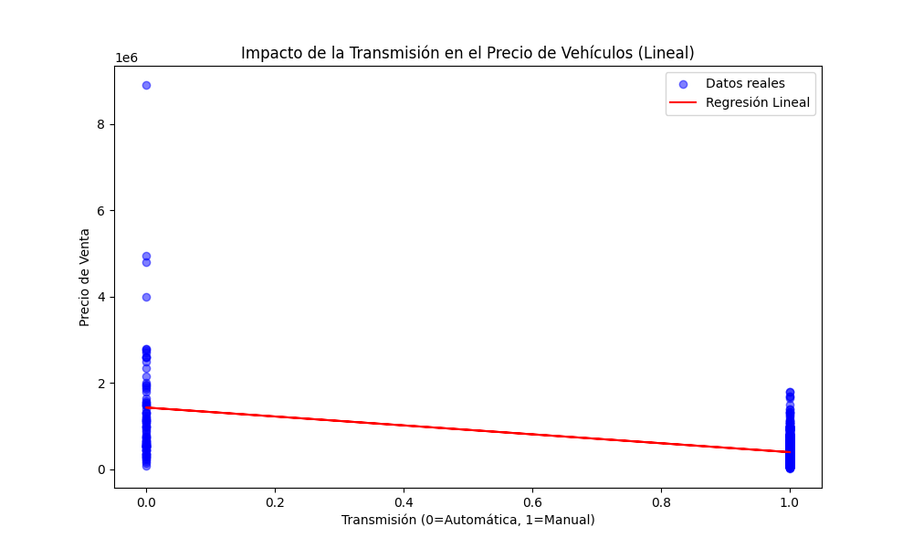
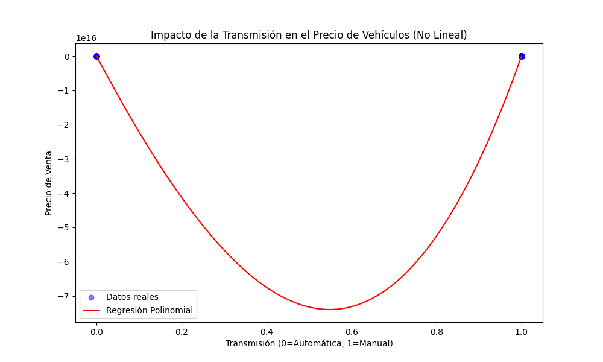
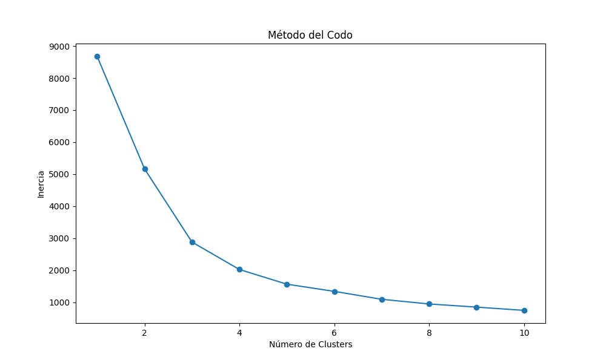
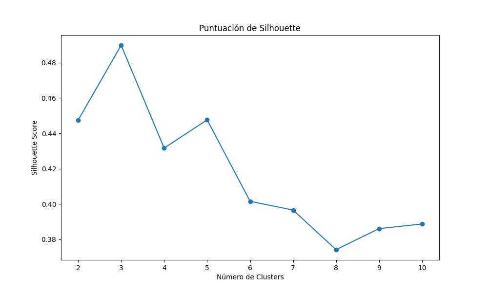
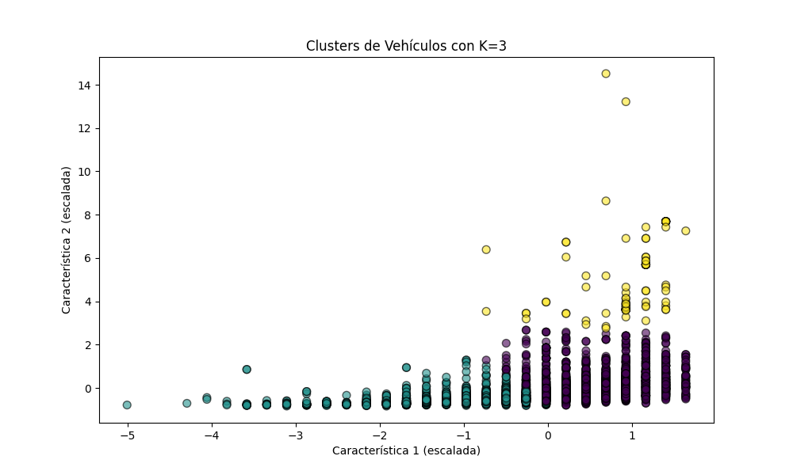

Tarea 6: Análisis de Datos de Detalles de Carros
================================================

Este programa realiza un análisis de datos exhaustivo sobre un conjunto de datos de detalles de vehículos. Utiliza técnicas de regresión y clustering para extraer insights y patrones significativos.

Pre-requisitos
--------------

Antes de ejecutar este programa, asegúrate de tener instalado Python y las siguientes librerías:

*   pandas
*   numpy
*   scikit-learn
*   matplotlib
*   kaggle (para descargar los datos)

También es necesario tener una cuenta en Kaggle y configurar el API token de Kaggle en tu máquina si se desea descargar el archivo `.csv` por su cuenta(el prgrama ya trae descargado el `.csv` a utilizar por lo que no se descagará ningún archivo a menos de que este se elimine del directorio).

Instalación de Dependencias
---------------------------

Para instalar las dependencias necesarias, ejecuta el siguiente comando:

`pip install pandas numpy scikit-learn matplotlib kaggle`

Configuración del API Token de Kaggle
-------------------------------------

1.  Ve a tu cuenta de Kaggle y navega a la sección de 'Account' para crear un API token.
2.  Descarga el archivo `kaggle.json`.
3.  Coloca este archivo en la ruta `~/.kaggle/` (para usuarios Unix/Mac) o `C:\Users\<Windows-username>\.kaggle\` (para usuarios de Windows).

Ejecución
---------

Para ejecutar el análisis completo el programa cuenta con un Makefile así que simplemente se debe ejecutar:

`make`

Este comando iniciará el proceso de análisis, que incluye la descarga del conjunto de datos (si es necesario), su limpieza, seguido por el análisis de regresión y clustering.

Salida
------

Los resultados del análisis se mostrarán en la terminal y se generarán gráficos que proporcionan una representación visual de los resultados de regresión y clustering.

# Parte Teórica
## Regresión:
1. **¿Qué es la regresión lineal y cómo se diferencia de la regresión no lineal?**
   La regresión lineal es un método estadístico que modela la relación entre una variable dependiente y una o más variables independientes asumiendo una relación lineal. Se diferencia de la regresión no lineal en que esta última asume que la relación entre las variables no sigue una línea recta, sino que puede ser modelada con funciones polinómicas, logarítmicas, exponenciales, entre otras.

2. **¿Qué son los coeficientes de regresión y qué información proporcionan sobre la relación entre las variables?**
   Los coeficientes de regresión son valores que multiplican a las variables independientes en la ecuación de la regresión. Proporcionan información sobre la fuerza y la dirección de la relación entre la variable dependiente y las variables independientes. Un coeficiente positivo indica una relación directa, mientras que un coeficiente negativo indica una relación inversa.

3. **¿Qué es el error cuadrático medio (MSE) y cómo se utiliza para evaluar la precisión de un modelo de regresión?**
   El error cuadrático medio (MSE) es una medida que calcula el promedio de los cuadrados de los errores entre los valores observados y los predichos por el modelo. Se utiliza para evaluar la precisión de un modelo de regresión; cuanto menor sea el MSE, más preciso es el modelo.

4. **¿Cuál es la diferencia entre regresión simple y regresión múltiple y cuándo se utiliza cada una?**
   La regresión simple utiliza una sola variable independiente para predecir una variable dependiente. La regresión múltiple utiliza dos o más variables independientes para el mismo propósito. La regresión simple se utiliza cuando se sospecha que una sola variable influye en la variable objetivo, mientras que la regresión múltiple se emplea cuando se quiere entender el impacto de varias variables.

## Clustering:
1. **¿Qué es el clustering y cuál es su objetivo principal en el análisis de datos?**
   El clustering es una técnica de aprendizaje automático no supervisado que agrupa los datos en clusters o grupos basándose en su similitud. El objetivo principal es identificar patrones o estructuras subyacentes en un conjunto de datos, agrupando objetos similares.

2. **Describa brevemente los algoritmos K-Means y DBSCAN y cómo funcionan.**
   - **K-Means** divide los datos en K clusters, asignando cada punto al centroide más cercano y ajustando los centroides de los clusters hasta que la asignación no cambie.
   - **DBSCAN** agrupa puntos basándose en su densidad, clasificando como outliers aquellos que están en regiones de baja densidad.

3. **¿Qué es la inercia en el contexto del clustering y cómo se utiliza para evaluar la calidad de un agrupamiento?**
   La inercia mide la suma de las distancias cuadradas de cada objeto del cluster a su centroide. Se utiliza para evaluar la calidad de un agrupamiento; valores más bajos indican que los objetos están más cerca de sus centroides, sugiriendo un mejor agrupamiento.

4. **¿Qué son los centroides y cómo se utilizan en el algoritmo K-Means?**
   Los centroides son los puntos que representan el centro de un cluster en el algoritmo K-Means. Se utilizan para determinar la pertenencia de los puntos a los clusters, asignando cada punto al centroide más cercano.

5. **Escriba la diferencia entre datos estructurados y no estructurados para análisis de datos.**
   Los datos estructurados están organizados en un formato definido, como tablas con columnas y filas, lo que facilita su análisis. Los datos no estructurados, como textos o imágenes, no tienen un formato predefinido, lo que requiere técnicas especiales para su procesamiento y análisis.

## Paquetes en Python (`__init__.py`):
1. **¿Qué es un paquete en Python y cómo se diferencia de un módulo?**
   Un paquete en Python es una forma de organizar módulos en directorios, permitiendo agrupar funcionalidades relacionadas. Un módulo es un archivo de Python, mientras que un paquete es un directorio que contiene módulos y un archivo `__init__.py`.

2. **¿Cuál es la función del archivo `__init__.py` dentro de un paquete de Python?**
   El archivo `__init__.py` se ejecuta cuando se importa el paquete y se utiliza para inicializar el paquete, pudiendo incluir código de inicialización para el paquete o especificar cuáles módulos del paquete deben ser exportados.

3. **¿Cómo se importa un módulo o función desde un paquete en Python?**
   Se utiliza la sintaxis `from paquete import modulo` o `from paquete.modulo import funcion` para importar específicamente módulos o funciones desde un paquete.

4. **¿Qué es la variable `__all__` en el archivo `__init__.py` y cuál es su propósito?**
   La variable `__all__` define una lista de nombres de módulos o atributos que serán importados cuando se use `from paquete import *`. Sirve para controlar qué símbolos son exportados cuando se realiza una importación con asterisco.

5. **¿Cuál es la ventaja de organizar el código en paquetes y módulos en Python?**
   Organizar el código en paquetes y módulos ayuda a mantenerlo estructurado, mejora la legibilidad, facilita la reutilización y el mantenimiento, y permite la encapsulación de funcionalidades.

## Python HTTP y Servicios Web (API):
1. **¿Qué es una API y cuál es su función en el contexto de los servicios web?**
   Una API (Interfaz de Programación de Aplicaciones) es un conjunto de reglas y especificaciones que permiten que diferentes aplicaciones se comuniquen entre sí. En el contexto de los servicios web, facilita la interacción entre diferentes sistemas y plataformas a través de internet.

2. **¿Cuál es la diferencia entre una API RESTful y una API SOAP?**
   Una API RESTful es una interfaz que utiliza HTTP y principios REST para comunicarse, es más flexible y fácil de usar. SOAP es un protocolo más antiguo y estricto que utiliza XML para el intercambio de mensajes, ofreciendo mayor seguridad y transacciones más formales.

3. **Describa los pasos básicos para consumir una API utilizando Python.**
   - Importar una biblioteca para hacer solicitudes HTTP, como `requests`.
   - Hacer una solicitud a la API utilizando el método adecuado (GET, POST, etc.).
   - Procesar la respuesta recibida, que suele estar en formato JSON.
   - Manejar errores y excepciones adecuadamente.

4. **¿Qué es la autenticación de API y por qué es importante?**
   La autenticación de API es el proceso que verifica la identidad de una solicitud para asegurar que solo los usuarios autorizados puedan acceder a los recursos de la API. Es importante para la seguridad y para controlar el acceso a datos sensibles.

5. **¿Cuál es el papel de los verbos HTTP (GET, POST, PUT, DELETE) en las solicitudes a una API y HTTP?**
   Los verbos HTTP definen la acción que se desea realizar sobre los recursos. GET se usa para solicitar datos, POST para enviar datos y crear recursos, PUT para actualizar recursos existentes, y DELETE para eliminar recursos.

# Análisis de Datos de Detalles de Carros

## Introducción
Este proyecto realiza un análisis detallado de un conjunto de datos de vehículos utilizando técnicas de regresión y clustering.

## Análisis de Regresión

### Regresión Lineal
La regresión lineal asume una relación directa entre las características y el precio. Observamos que algunos factores, como el año del vehículo, muestran una correlación directa con el precio, lo que indica que a medida que el vehículo es más nuevo, su precio tiende a ser mayor.

### Regresión No Lineal
La regresión no lineal nos permite capturar relaciones más complejas. Por ejemplo, cuando observamos la relación entre el año del vehículo y su precio a través de un modelo polinomial, encontramos que la relación no es estrictamente lineal y puede verse afectada por otros factores como la marca o el modelo del vehículo.

### Regresión Lineal por Transmisión
La regresión lineal sugiere que hay una diferencia en el precio de venta entre las transmisiones manuales y automáticas, con los vehículos automáticos mostrando generalmente un precio más alto.

### Regresión No Lineal por Transmisión
La regresión no lineal muestra una tendencia similar, pero captura las variaciones en los precios con mayor precisión, lo que indica que hay otros factores en juego además del tipo de transmisión que influyen en el precio.

## Análisis de Clustering

### Método del Codo
El método del codo sugiere que el número óptimo de clusters para este conjunto de datos está alrededor de tres o cuatro, basándonos en el punto donde la inercia comienza a disminuir a un ritmo más lento.

### Puntuación de Silhouette
La puntuación de Silhouette alcanza un pico para tres clusters, lo que sugiere que esta es una buena elección para nuestro número de clusters, ya que proporciona una separación clara y cohesión dentro de los clusters.

### Visualización de Clusters
Los clusters visualizados muestran agrupaciones claras de vehículos en el espacio de características seleccionado. Estas agrupaciones pueden corresponder a diferentes segmentos de mercado, como coches económicos, de lujo o utilitarios.

